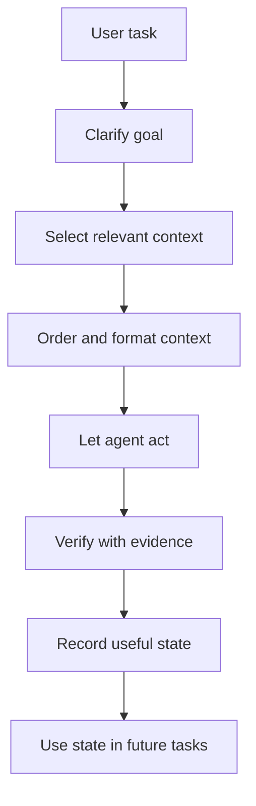
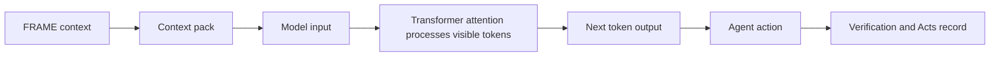

---
tags:
  - research/topic-1
  - context-engineering
  - attention
  - frame/future
status: draft-1
date: 2026-05-22
---

# Research 1: From Attention To Context Engineering

## Plain-Language Summary

The core story is this:

Modern LLMs became powerful because transformer models made it much easier to learn relationships across text. The famous 2017 paper [[90 Sources#Attention Is All You Need|Attention Is All You Need]] made attention the main engine instead of a helper bolted onto older sequence models.

But attention is not context.

- **Attention** is what happens inside the model.
- **Context** is the information the model can currently see.
- **Context engineering** is how we choose, arrange, shorten, fetch, protect, and check that information.

The future is probably not just "write a better prompt." It is more like:

> Build better information systems around models so they receive the right truth, at the right time, in the right shape, with proof attached.

That is where FRAME + Haxaml becomes interesting.

FRAME can be studied as a project-level context architecture:

| FRAME file | Context role |
| --- | --- |
| `facts.yaml` | stable truth |
| `rules.yaml` | hard limits and behavior rules |
| `acts.yaml` | what actually happened |
| `map.yaml` | where to look and what may break |
| `expect.yaml` | what should happen next |

Haxaml can be studied as the tool that turns those files into useful agent context, gates work when needed, and records proof afterward.

## The Tiny Model Primer

Start small.

An LLM does not "read" like a human. It receives text as [[01 Tokens|tokens]], turns them into numbers, compares relationships, and predicts what token should come next.

### 1. Token

A token is a small chunk of text.

Examples:

- `"cat"` may be one token.
- `"unbelievable"` may split into multiple pieces.
- punctuation and spaces may matter.

Practical meaning:

> Token budget is the model's working space. If you waste it, the model may miss the thing that matters.

### 2. Next-token prediction

The model's basic move is:

```text
given everything visible so far -> predict the next likely token
```

This sounds simple, but the model learns a lot of patterns while doing it:

- grammar
- facts
- style
- code structure
- reasoning-like steps
- tool-use patterns
- common project workflows

Analogy:

> It is like autocomplete that grew up, went to engineering school, read half the internet, and still needs a clean task brief before touching production.

### 3. Context window

The [[03 Context Window|context window]] is the visible workspace for a model run.

It may include:

- system/developer instructions
- user request
- chat history
- repo files
- tool results
- generated summaries
- examples
- schemas
- previous actions

Important:

> Bigger context is not the same as better context.

A huge messy workspace can still make someone slower.

## Attention Explained Without Fog

Attention is a way for the model to decide which visible tokens matter to each other.

In the Transformer paper, attention lets each position in a sequence look at other positions and weigh how useful they are for producing the next representation.

Plain version:

> The model does not treat all visible words equally. It builds weighted links between them.

Example:

```text
The package failed because it could not find pyproject.toml.
```

A useful model should connect:

- `package`
- `failed`
- `could not find`
- `pyproject.toml`

Attention is part of how the model learns those links.

### Attention is not understanding by itself

Attention is powerful, but it is not a magic truth engine.

The model can still:

- focus on the wrong thing
- miss relevant text in a long context
- be distracted by noisy context
- use old or false context confidently
- produce a polished answer without enough evidence

That is why context architecture still matters.

## Why Transformers Changed The Game

Before Transformers, many strong language models used sequence-processing designs that handled text step by step. The Transformer showed that attention could be the main architecture for sequence modeling.

The big practical shifts:

| Shift | Why it mattered |
| --- | --- |
| More parallel training | Models could train more efficiently at scale. |
| Better long-range linking | Tokens could relate to far-away tokens more directly. |
| Architecture reuse | The same family could power translation, chat, code, multimodal work, and agents. |
| Scaling path | Larger models plus more data plus better training became a clear race path. |

Modern LLMs are not identical copies of the 2017 model, but they are strongly shaped by the Transformer family.

## Prompt Engineering Timeline

Prompt engineering grew because people realized the same model could behave very differently depending on task setup.

The simple idea:

> If the model predicts from the visible context, then changing that visible context changes the output.

### Phase 1: Clear instructions

People learned that models respond better when the task is explicit:

- what to do
- what not to do
- what format to use
- what audience to write for

### Phase 2: Examples and few-shot prompting

Few-shot prompting gives examples inside the prompt.

Analogy:

> Instead of saying "write like this," you show two or three examples and let the model copy the pattern.

This works because examples become part of the visible context.

### Phase 3: Reasoning-style prompts

Papers like [[90 Sources#Chain-of-Thought Prompting|Chain-of-Thought Prompting]] showed that giving reasoning examples can improve some reasoning tasks.

Careful wording:

- It can help on some tasks.
- It is not universal.
- It does not mean hidden reasoning should be stored as project state.

For FRAME, the important lesson is:

> Store decisions, proof, and outcomes. Do not store messy private reasoning as the project brain.

### Phase 4: Tool and action loops

[[90 Sources#ReAct|ReAct]] connected reasoning-style traces with actions, like searching or using tools.

This matters because agents do not only answer. They:

- inspect files
- run commands
- call APIs
- edit code
- verify results

Once tools enter the loop, the prompt is no longer just text. The full environment matters.

### Phase 5: Retrieval and external memory

[[90 Sources#Retrieval-Augmented Generation|Retrieval-Augmented Generation]] showed the value of fetching external information instead of relying only on model weights.

In coding-agent terms:

- do not stuff the whole repo into the prompt
- fetch the files likely related to the task
- keep source paths attached
- verify before claiming done

That is the bridge from prompt engineering to context engineering.

## Context Engineering Timeline

Context engineering is a wider frame than prompt engineering.

Prompt engineering asks:

> What should I write in the prompt?

Context engineering asks:

> What should the model see, when should it see it, how should it be ordered, what should be kept exact, what should be shortened, and what should be blocked?

That is a much better fit for agents.

### A practical context-engineering stack



For normal chat, prompt engineering may be enough.

For repo work, it is not.

Repo work needs:

- file selection
- project rules
- recent history
- blockers
- tests
- command output
- source paths
- handoff notes

That is context engineering territory.

## Long-Context Reality Check

Long context windows are useful. They let models see more.

But research like [[90 Sources#Lost In The Middle|Lost in the Middle]] showed that models can perform worse when the useful information is buried in the middle of long input.

Benchmarks like [[90 Sources#RULER|RULER]] also test whether long-context models can really use their full claimed context length. [[90 Sources#NoLiMa|NoLiMa]] pushes on whether models rely too much on simple word matching instead of deeper understanding in long contexts.

The practical takeaway:

> Bigger windows give more room. They do not automatically clean the room.

### Long context failure modes

| Failure                | What it looks like in agent work                                |
| ---------------------- | --------------------------------------------------------------- |
| Needle buried in noise | The answer is in the files, but the agent misses it.            |
| Stale memory           | Old project state overrides newer truth.                        |
| Wrong ordering         | Important constraints appear too late or too quietly.           |
| Context pollution      | Irrelevant details distract the model.                          |
| False confidence       | The model says "done" because the final answer sounds complete. |
| Weak proof             | The output has no link to tests, files, or command evidence.    |

This is exactly the gap FRAME is trying to address.

## Where The AI Race Seems To Be Going

This part is inference from current papers and official agent docs, not a prophecy.

The model race is still real:

- stronger base models
- better reasoning models
- larger context windows
- multimodal inputs
- faster inference
- lower cost

But the product race is also shifting toward systems around the model:

| Direction | Why it matters |
| --- | --- |
| Context management | Models need the right info, not just more info. |
| Agent loops | Useful agents inspect, act, verify, and continue. |
| Tool use | Models become more useful when connected to files, shells, browsers, APIs, and tests. |
| Memory | Multi-session work needs useful state, not raw chat replay. |
| Compaction | Long history must become short enough to keep using. |
| Evaluation | Teams need to prove agents work, not just vibe-check outputs. |
| Protocols | Tools need shared ways to pass context, resources, and state. |

The best future skill may not be "prompt wizard."

It may be:

> context architect: someone who designs what the model sees, what it is allowed to trust, what it must prove, and what gets remembered.

## What This Means For Haxaml

Haxaml should not position FRAME as a prompt trick.

FRAME is better positioned as:

> a structured project-context model for AI-agent work.

The link to attention is real but indirect:



FRAME does not change the model's internal attention mechanism.

FRAME changes the **information environment** the attention mechanism receives.

That is still a big deal.

Analogy:

> FRAME does not make the flashlight brighter. It labels the room, removes junk from the floor, locks the dangerous drawers, and puts the mission brief on the desk.

## What This Means For `0.8`

Research 1 suggests `0.8` should avoid vague claims and focus on practical context architecture.

Good `0.8` direction:

- define what each FRAME file means
- define what must always be included
- define what can be fetched only when needed
- define what blocks work
- define what must be recorded as proof
- define what can be summarized safely
- define what must stay exact
- define how provider adapters are generated from FRAME

Bad `0.8` direction:

- claim FRAME is "attention for projects"
- dump every prompt trick into YAML
- store raw reasoning traces as project memory
- treat long context as the whole answer
- make `expect.yaml` a magic plan file without evidence rules

## Claims Table

| Claim | Label | Why |
| --- | --- | --- |
| Transformers are foundational to modern LLMs. | Evidence | The Transformer paper introduced the architecture family modern LLMs build from. |
| Attention is not the same thing as context. | Evidence | Attention is a model mechanism; context is input/state visible to the model. |
| Better context often improves outputs. | Evidence | Prompting, RAG, and agent docs all depend on shaping visible information. |
| Bigger context windows are not enough by themselves. | Evidence | Long-context studies show models can miss or misuse information in long inputs. |
| Context engineering is becoming more important for agents. | Inference | Agent docs and recent surveys focus on memory, tools, retrieval, compression, and state. |
| FRAME is a strong match for context engineering. | Hypothesis | The roles line up well, but it still needs comparison and evals. |
| FRAME's exact five-file model is the best possible design. | Unknown | Research 2-4 must test this instead of assuming it. |

## Bottom Line

Your theory is pointing in the right direction, but the clean version is:

> Since models generate from visible context and attention decides what relationships inside that context matter, the future of reliable agent work depends heavily on context quality, not only model size.

That is the lane FRAME should fight for.

Not "better prompt hacks."

Project context architecture.
