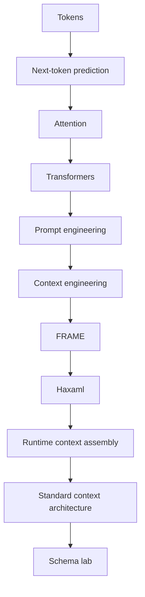

---
tags:
  - study/path
  - concept/core
---

# Study Notes Index

These notes are the minimum learning path from `capability.md`, rewritten for Obsidian.

Use them like a small course.

## Read In This Order

1. [[01 Tokens]]
2. [[02 Next Token Prediction]]
3. [[03 Context Window]]
4. [[04 Attention]]
5. [[05 Transformers]]
6. [[06 Prompt Engineering]]
7. [[07 Context Engineering]]
8. [[08 Retrieval]]
9. [[09 Memory]]
10. [[10 Compaction]]
11. [[11 Schemas Protocols Evals]]
12. [[12 Prompt Technique To FRAME Cheat Sheet]]
13. [[13 FRAME File Roles]]
14. [[14 Runtime Context Assembly]]
15. [[15 Trust Boundaries]]
16. [[16 Standard Context Architecture Candidate]]
17. [[17 Project Brain]]
18. [[18 Schema Lab]]
19. [[19 FRAME Schema Slices]]

## The Whole Path In One Sentence

> LLMs predict tokens from visible context, attention helps them weigh relationships inside that context, and reliable agents need a structured system for choosing, checking, and remembering the right context.

## Why This Matters For FRAME

FRAME is easier to understand if you see the stack:

## What To Practice

After reading each note, ask:

- What is the smallest version of this idea?
- What can go wrong if a coding agent ignores it?
- Which FRAME file would help with it?
- What would Haxaml need to enforce or check?

## Research 2 Add-On

Research 2 adds the practical bridge:

> Prompt techniques become useful project architecture only when stable context goes into FRAME, temporary context stays in runtime, and provider-specific wording stays in adapters.

Start with [[12 Prompt Technique To FRAME Cheat Sheet]] if you want the fast map.

## Research 3 Add-On

Research 3 adds the standard architecture question:

> Can FRAME become a shared repo-owned project-brain structure, or is it only Haxaml config?

Start with [[16 Standard Context Architecture Candidate]], then [[17 Project Brain]], then [[18 Schema Lab]].

## Schema Research Add-On

The `0.8.0` opening schema research starts with:

- [[19 FRAME Schema Slices]]
- [[09 FRAME Schema Research 0_8_0 Opening]]
- [[FRAME Schema Candidate Canvas.canvas]]
