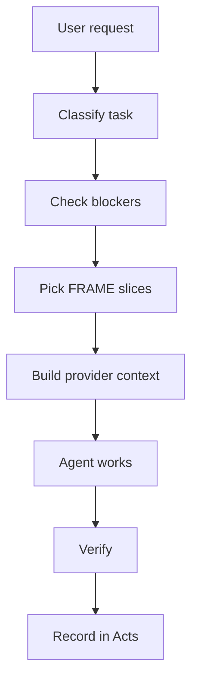

---
tags:
  - study/path
  - haxaml/runtime
  - context-engineering
---

# Runtime Context Assembly

## Tiny Idea

Runtime context assembly means:

> choose the right project context for this task, then arrange it so the agent can use it.

It is like packing a tool bag.

You do not bring the whole garage.
You bring the wrench, the manual, the parts list, and the safety rule for the job.

## What Haxaml Should Do

## Context Order

A useful order to test:

1. platform/system rules
2. project hard rules
3. blocking task requirements
4. stable facts
5. expected outcome
6. relevant map
7. recent acts
8. older history only if needed

## Why Order Matters

If old history appears stronger than current rules, the agent can follow stale context.

If file maps come before the task goal, the agent may inspect files without knowing why.

If verification comes last as an afterthought, the agent may claim done too early.

Related:

- [[04 Haxaml As Runtime Context Engine]]
- [[15 Trust Boundaries]]

