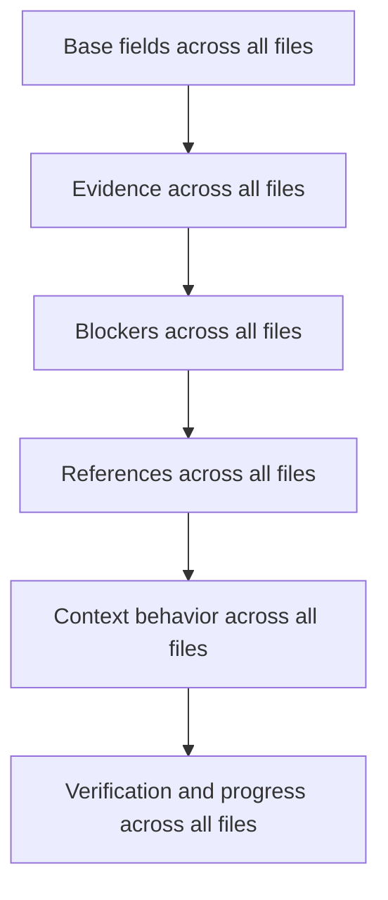

---
tags:
  - study/path
  - frame/schema
  - roadmap/0.8
---

# FRAME Schema Slices

## Tiny Idea

A schema slice is one layer of meaning added across all five FRAME files.

Not one file at a time.

One layer across the whole system.

## The Slice Plan

| Slice | Plain meaning |
| --- | --- |
| `0.8.0` | every file has a tiny honest base |
| `0.8.1` | every important claim can point to a source |
| `0.8.2` | unknowns, blockers, and advice mean the same thing everywhere |
| `0.8.3` | files can safely reference each other |
| `0.8.4` | FRAME controls what context Haxaml loads |
| `0.8.5` | planned work, real work, and proof connect |
| `0.8.6` | schema lab tests real project shapes |
| `0.8.7` | freeze what survived |

## Why This Matters

If Facts is fully designed before Rules, it may miss what Rules needs.

If Expect is designed before Acts, it may become fake planning.

If Map is designed before real project tests, it may only fit clean repos.

So FRAME should mature like this:

Related:

- [[09 FRAME Schema Research 0_8_0 Opening]]
- [[10 Connected FRAME Candidate Matrix]]
- [[11 Semantic Connection Rules]]

