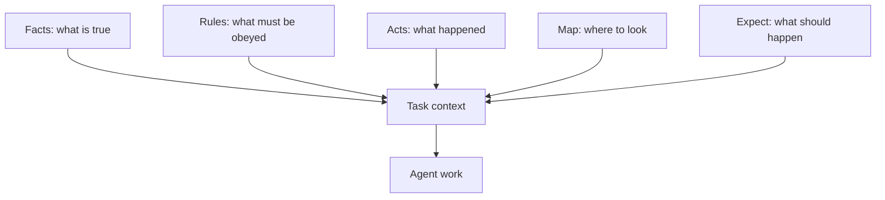
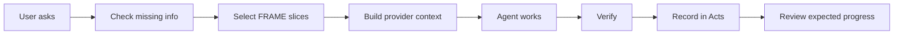

---
tags:
  - research/topic-2
  - prompt-engineering
  - context-engineering
  - frame/mapping
status: draft-1
date: 2026-05-23
---
..
# Research 2: Prompt Engineering Mapped To FRAME

## Plain-Language Summary

Research 1 showed the base idea:

> Models generate from what they can see, but bigger context does not automatically mean better work.

Research 2 asks the next question:

> If prompt engineering is task setup, can FRAME become durable project setup?

My conclusion from this pass:

> FRAME is a strong fit for the stable parts of prompting and context engineering. It is a weak fit for temporary wording tricks, provider-specific style, and raw reasoning traces.

That gives us a clean split:

| Layer | What belongs there |
| --- | --- |
| FRAME | stable facts, hard rules, expected work, project history, file map |
| Haxaml runtime | which pieces to load for this task, in what order, with what checks |
| adapters | provider-specific wording for Codex, Claude, Gemini, Copilot, and others |
| session output | temporary reasoning, tool results, draft plans, throwaway examples |

Tiny version:

> FRAME should be the reusable project brain, not the final prompt text.

## Prompt Engineering Recap

Prompt engineering is not magic wording.

It is the practice of setting up the model's task through:

- role
- instructions
- constraints
- examples
- output format
- tools
- success criteria
- missing-info handling

[[90 Research 2 Sources#The Prompt Report|The Prompt Report]] is useful here because it shows prompt engineering as a wide family of techniques, not one trick. OpenAI and Anthropic docs also frame prompting as clear task setup, examples, structure, and iteration rather than secret words.

Simple example:

```text
You are a senior backend engineer.
Change only the payment module.
Return a short summary and tests run.
If API keys are missing, stop and ask.
```

That prompt contains four different roles:

| Prompt part | Actual job |
| --- | --- |
| senior backend engineer | role/persona |
| change only payment module | scope rule |
| summary and tests run | output contract |
| stop and ask | blocking gate |

FRAME's job is to stop those from being buried in random chats.

## Context Engineering Recap

Context engineering is bigger than prompt engineering.

Prompt engineering asks:

> What should I say to the model?

Context engineering asks:

> What should the model see, what should it not see, and what should be checked before work starts?

For coding agents, context can include:

- repo instructions
- current user request
- relevant files
- old decisions
- test output
- tool results
- schemas
- project rules
- acceptance criteria
- blocked materials
- provider-specific instructions

The important move:

> Context engineering turns prompting from sentence-writing into information architecture.

That is the natural home for FRAME.

## The Core Mapping

Here is the practical mapping from common prompt/context techniques to FRAME.

| Prompt or context technique | FRAME home                                  | Why it fits                                                                      |
| --------------------------- | ------------------------------------------- | -------------------------------------------------------------------------------- |
| Persona / role              | `rules.yaml` + `facts.yaml`                 | The agent behavior belongs in Rules; project identity belongs in Facts.          |
| Project identity            | `facts.yaml`                                | Stable truth should not be repeated in every prompt.                             |
| Hard constraints            | `rules.yaml`                                | Rules are the clearest place for "must" and "must not."                          |
| Task goal                   | `expect.yaml`                               | Goals and planned outcomes are future-facing.                                    |
| Acceptance criteria         | `expect.yaml`                               | Done checks define what should be true after work.                               |
| Few-shot examples           | `rules.yaml`, adapters, or generated prompt | Stable examples may become Rules; temporary examples should stay generated.      |
| Output format               | adapters + `expect.yaml`                    | Provider format belongs in adapters; result expectations belong in Expect.       |
| Tool-use policy             | `rules.yaml` + runtime                      | Rules say when tools are required; Haxaml exposes and checks them.               |
| Retrieval                   | `map.yaml` + runtime                        | Map helps find the right files; runtime fetches the slice.                       |
| Memory                      | `acts.yaml` plus other FRAME files          | Memory should be split by role, not stored as one blob.                          |
| Chain-of-thought            | mostly not stored                           | Store decisions, proof, and outcomes, not raw private reasoning.                 |
| ReAct-style action loop     | Haxaml runtime + `acts.yaml`                | Actions and observations belong in the run loop and record.                      |
| Verification rubric         | `rules.yaml` + `expect.yaml` + `acts.yaml`  | Rules require proof, Expect says what proof matters, Acts records what happened. |

## FRAME As Structured Prompt Memory

FRAME is not one prompt.

It is more like a reusable prompt supply system.



The key win is role separation.

A normal mega-prompt often mixes:

- identity
- rules
- current task
- old history
- examples
- file paths
- done checks
- output style

FRAME gives those things separate homes.

Analogy:

> A mega-prompt is one backpack stuffed with laptop, lunch, charger, documents, and wet shoes. FRAME is shelves with labels. The same stuff may exist, but now it is easier to find and safer to update.

## Haxaml As Runtime Context Engine

Haxaml's job is not to be the model.

Haxaml's job is to build and police the model's working context.

Plain flow:



Important:

> The generated provider prompt should be treated like build output. FRAME is the source code.

That means:

- `AGENTS.md`, `CLAUDE.md`, skills, and MCP config can be generated or refreshed.
- FRAME should remain the cleaner source of project meaning.
- Provider files should not silently become a second project brain.

## Where The Mapping Is Strong

FRAME maps well when the thing is durable.

| Durable context | Why FRAME helps |
| --- | --- |
| project identity | avoids repeating vague project background |
| hard rules | keeps constraints above temporary tool output |
| acceptance criteria | lets agents check "done" against something stable |
| recent decisions | gives the next session useful continuity |
| file map | reduces random repo wandering |
| blockers | prevents fake progress when needed info is missing |
| verification evidence | makes "done" easier to audit |

This is the best argument for FRAME:

> It turns recurring prompt instructions into maintainable project state.

## Where The Mapping Is Weak

FRAME gets weaker when the prompt technique is short-lived or provider-specific.

Weak fits:

- exact prompt phrasing
- XML/tag tricks
- prompt style made for one model only
- giant example banks
- raw chain-of-thought
- temporary brainstorming
- tone-only persona text
- tool output that has not been checked

The design warning:

> If FRAME stores every prompt trick, it becomes the messy prompt it was supposed to replace.

## What Should Be Schema, Adapter, Runtime, Or Docs

Research 2 points to four buckets.

| Bucket | Plain job | Examples |
| --- | --- | --- |
| schema | machine-checkable project truth | facts fields, rule severity, blockers, done criteria |
| adapter | provider-specific surface | AGENTS.md, CLAUDE.md, skills, Copilot instructions |
| runtime | task-time decisions | context selection, missing-info gates, verification checks |
| docs | human explanation | why the architecture exists, examples, migration guides |

The 0.8 mistake to avoid:

> Do not solve every design problem by adding more YAML fields.

Some things should be behavior, not data.

## What This Means For 0.8

Research 2 suggests these 0.8 priorities:

| Priority | Plain meaning |
| --- | --- |
| define FRAME file roles tightly | make each file answer a different project question |
| define context policies | say what is always loaded, task-scoped, archived, exact, or summary-safe |
| separate source truth from generated prompts | adapters should not compete with FRAME |
| keep raw reasoning out of Acts | record decisions, evidence, and outcomes instead |
| make blockers real | missing blocking info should stop work, not become a polite warning |
| add mapping examples | show how common prompting patterns become FRAME fields |

## Bottom Line

FRAME is not "prompt engineering in YAML."

Better wording:

> FRAME is a repo-owned context structure that stores the reusable parts of prompting and agent work. Haxaml turns that structure into task-specific context, checks missing info, and records proof.

That is precise enough to research further without pretending the architecture is already finished.
