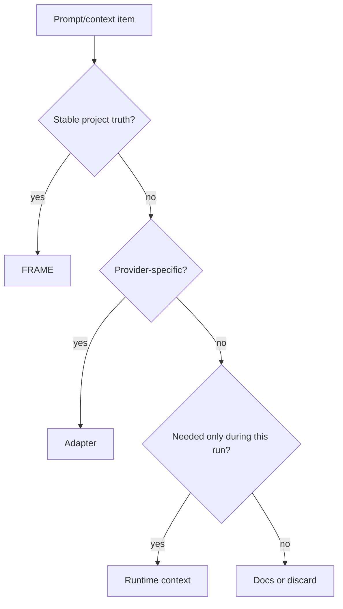

---
tags:
  - research/topic-2
  - frame/mapping
  - prompt-engineering
status: draft-1
date: 2026-05-23
---

# Technique Mapping Table

## Tiny Idea

This note is the practical cheat sheet.

For each prompt or context technique, ask:

> Is this stable project truth, task-specific setup, provider-specific wording, or temporary session material?

That one question decides where it belongs.

## Mapping Table

| Technique | Plain meaning | Best FRAME or Haxaml home | Confidence | Why |
| --- | --- | --- | --- | --- |
| Persona / role | Tell the model what kind of helper to act as | `rules.yaml` for behavior, `facts.yaml` for project identity | High | Stable role instructions should survive across sessions. |
| System instructions | Highest-priority behavior instructions in a provider stack | adapter generated from `rules.yaml` | High | Provider format differs, but the project rule should stay canonical. |
| Constraints | Hard limits like "do not edit generated files" | `rules.yaml` | High | This is exactly what Rules should protect. |
| Task goal | What this run should achieve | `expect.yaml` or task prebuild state | High | The goal points forward. |
| Acceptance criteria | What must be true before done | `expect.yaml` | High | Done checks are future-facing and testable. |
| Few-shot examples | Show examples of good output | `rules.yaml` if stable; adapter/runtime if temporary | Medium | Examples can be useful, but can also bloat context. |
| Output format | Shape of the response or artifact | adapter + `expect.yaml` | Medium-high | Exact provider format is adapter-level; expected deliverable is Expect-level. |
| Chain-of-thought prompting | Encourage step-by-step reasoning | not canonical FRAME state | High | Store public decisions and proof, not raw reasoning traces. |
| Self-consistency | Sample multiple answers and compare | runtime/eval layer | Medium | This is behavior during work, not project memory. |
| ReAct | Reason and act with tool observations | Haxaml runtime + `acts.yaml` record | High | The loop happens at runtime; outcomes belong in Acts. |
| Tool-use policy | When to search, run tests, ask, or stop | `rules.yaml` + runtime tool permissions | High | Rules define policy; runtime enforces availability. |
| Retrieval | Fetch relevant external or local info | `map.yaml` + runtime context selection | High | Map routes; runtime fetches. |
| Memory | Keep useful info across sessions | split across FRAME files, especially `acts.yaml` | High | Different memory types need different homes. |
| Compaction | Shorten long history into useful state | Acts archive policy + runtime summaries | High | History must stay usable, not become replay noise. |
| Prompt templates | Repeatable prompt shapes | adapters or generated context | Medium | Templates are useful output, not always architecture truth. |
| Guardrails | Rules that block unsafe or invalid work | `rules.yaml` + prebuild gates | High | Blocking policy needs stable storage and runtime checks. |
| Rubrics | Criteria for judging quality | `expect.yaml` + `rules.yaml` | Medium-high | Project-wide quality belongs in Rules; task-specific pass criteria in Expect. |
| Project map | Quick view of where files live | `map.yaml` | High | This is Map's core job. |
| Source links | Evidence for claims | `acts.yaml`, `map.yaml`, docs fields | High | Claims without source paths become trust debt. |
| Model-specific phrasing | Words that work better for one provider | adapter only | High | This must not pollute canonical FRAME. |

## Strong Rule

> If the information should be true for every agent, put it in FRAME. If it only helps one provider phrase the task, keep it in an adapter.

## Quick Decision Tree

## The Big Boundary

FRAME should collect:

- truth
- rules
- evidence
- expected progress
- routing hints

FRAME should avoid collecting:

- vibes
- prompt hacks
- provider quirks
- raw reasoning
- unchecked tool output
