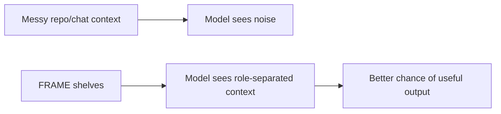

---
tags:
  - research/topic-2
  - frame/memory
  - context-engineering
status: draft-1
date: 2026-05-23
---

# FRAME As Structured Prompt Memory

## Tiny Idea

FRAME can be understood as prompt memory with shelves.

Not one memory blob.
Not one giant instruction file.
Not a chat transcript.

Shelves.

## Why One Big Memory File Breaks Down

A single memory file tends to mix too many jobs:

- project identity
- coding rules
- old work
- planned work
- file paths
- user preferences
- test notes
- open questions
- random summaries

That works for small projects.

It gets messy when:

- the project grows
- agents switch
- old decisions become wrong
- different tools write different instructions
- the next session cannot tell what is rule, fact, plan, or history

Analogy:

> One big memory file is a group chat. FRAME is a project board with columns.

## FRAME Shelves

| FRAME file | Memory type | Should change often? | Plain question |
| --- | --- | --- | --- |
| `facts.yaml` | stable identity and truth | rarely | What is this project? |
| `rules.yaml` | constraints and required behavior | sometimes | What must agents obey? |
| `acts.yaml` | work history and evidence | often | What actually happened? |
| `map.yaml` | file and module routing | sometimes | Where should agents look? |
| `expect.yaml` | expected path and checklist | sometimes/often | What should happen next? |

## How This Maps To Prompting

A normal prompt may say:

```text
You are working on a Python package called Haxaml.
Do not overwrite user changes.
Continue from the last setup TUI work.
Touch the setup files only.
Verify with uv run pytest tests/test_cli.py.
Return summary and risks.
```

FRAME splits that:

| Prompt line | FRAME home |
| --- | --- |
| Python package called Haxaml | `facts.yaml` |
| do not overwrite user changes | `rules.yaml` |
| continue from last setup TUI work | `acts.yaml` |
| touch setup files only | `map.yaml` + task scope |
| verify with pytest | `expect.yaml` + `rules.yaml` |
| return summary and risks | adapter/output contract |

## Why This Helps Attention

Research 1 corrected the wording:

> Attention is not context. Attention works over context.

FRAME helps by shaping the context before attention ever gets involved.



This is not magic.

It simply reduces the chance that the model has to guess which instruction is current, which note is old, and which file matters.

## The Important Design Rule

> FRAME memory should be boring enough to trust.

That means:

- short labels
- clear ownership
- source paths
- dates where needed
- exact blockers
- evidence links
- no fake certainty
- no private reasoning dumps

The best project brain is not the fanciest one.
It is the one the next agent can read without getting baited by stale noise.

