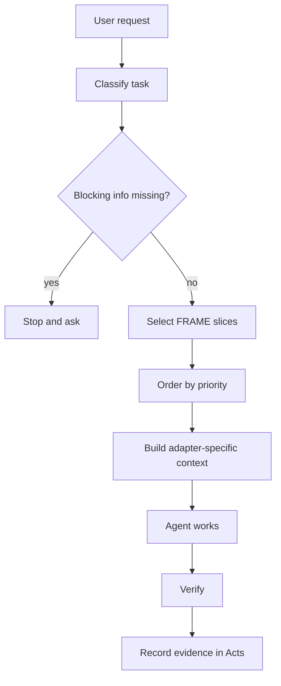

---
tags:
  - research/topic-2
  - haxaml/runtime
  - context-engineering
status: draft-1
date: 2026-05-23
---

# Haxaml As Runtime Context Engine

## Tiny Idea

FRAME stores the reusable project context.

Haxaml decides what to do with it during a real task.

Analogy:

- FRAME is the pantry.
- Haxaml is the cook.
- The agent prompt is the plate served for this specific meal.

## Why Runtime Matters

Even clean FRAME files are not enough.

For each task, the system still has to decide:

- which facts matter
- which rules are mandatory
- which acts are recent enough
- which old acts should be searched only if needed
- which map areas are relevant
- which expectations apply
- whether missing info blocks work
- what evidence must be produced

That is runtime behavior.

## Context Assembly Flow

## Priority Order To Test

Research 2 does not finalize the lifecycle, but it suggests a likely priority stack:

| Priority | Context type | Why |
| --- | --- | --- |
| 1 | system/developer safety and platform rules | cannot be overridden by project context |
| 2 | `rules.yaml` hard rules | project-level constraints should beat old memory |
| 3 | blocking task requirements | missing required materials should stop work |
| 4 | `facts.yaml` stable truth | project identity and config shape the work |
| 5 | `expect.yaml` task goals and done checks | tells the agent what good completion means |
| 6 | `map.yaml` routing hints | tells the agent where to inspect |
| 7 | recent `acts.yaml` continuity | tells the agent what just happened |
| 8 | archived history | fetched only when the current task needs it |

This priority stack is a hypothesis for Research 4 to test.

## Haxaml Should Not Be Just A Prompt Printer

If Haxaml only prints instructions, it is not doing enough.

The useful runtime jobs are:

| Runtime job | Plain meaning |
| --- | --- |
| classify | understand the task type before building |
| gate | stop if required info is missing |
| select | choose the relevant context instead of dumping all files |
| order | put stronger truth before weaker context |
| isolate | keep untrusted tool output from overriding rules |
| verify | require evidence before recording success |
| record | write what happened in Acts |
| review | compare reality against Expect without forcing Expect to be the final write |

## Key Boundary

The generated prompt is not sacred.

It is a temporary output made from FRAME plus runtime choices.

That means Haxaml can improve provider prompts over time without changing the core FRAME meaning.

This is how FRAME can stay standard-shaped while Haxaml keeps experimenting.
