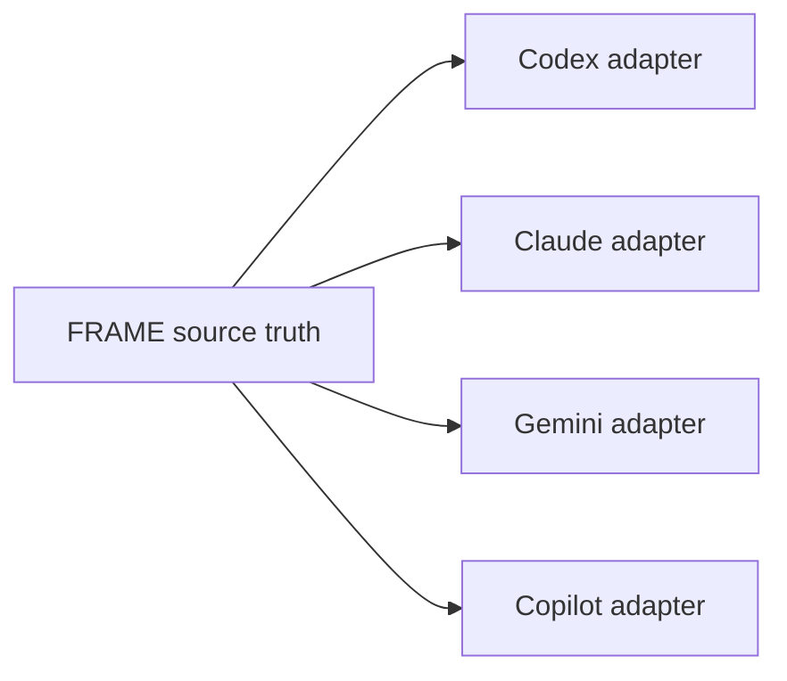

---
tags:
  - research/topic-2
  - frame/boundaries
  - prompt-engineering
status: draft-1
date: 2026-05-23
---

# Weak Mappings And Boundaries

## Tiny Idea

Not every prompt technique deserves a FRAME field.

That is not a weakness.
That is how the architecture stays clean.

## Weak Fit List

| Thing | Why it should not become core FRAME |
| --- | --- |
| exact prompt wording | wording changes by model and provider |
| XML/tag tricks | useful for some models, but not project truth |
| tone-heavy persona text | often style, not durable behavior |
| giant few-shot banks | can bloat context and hide the actual task |
| raw chain-of-thought | private reasoning is not clean project state |
| temporary examples | useful once, noisy later |
| unchecked tool output | external output may be wrong or hostile |
| old summaries without source links | can become confident stale memory |

## Raw Reasoning Boundary

Chain-of-thought style prompting can help some reasoning tasks, but FRAME should not store raw internal reasoning as canonical memory.

Better to store:

- decision made
- why it was made in public terms
- files inspected
- tests run
- blockers left
- evidence links

Bad Acts record:

```text
I thought about it for a long time and then realized the function was wrong...
```

Better Acts record:

```text
Changed setup target ordering because explicit provider choice was being hidden by generic fallback.
Verified with tests/test_cli.py::test_setup_targets_order.
Remaining risk: no Windows terminal snapshot yet.
```

## Provider-Specific Boundary

Some providers prefer different prompt shapes.

Examples:

- XML tags
- markdown sections
- strict JSON schemas
- tool declaration formats
- skill files
- instruction hierarchy

Those are real.

But they belong in adapters, not core FRAME.



The adapter can speak the provider's language.
FRAME should speak the project's language.

## The Bloat Trap

FRAME can fail by becoming too complete.

If every prompt trick becomes a field, the files become hard to read and hard to maintain.

Architecture rule to test:

> Add a FRAME field only when another tool or future agent can depend on its meaning.

If the field only changes one prompt template, it probably belongs in adapter config.

## Trust Boundary

Retrieved context and tool output should be treated as evidence, not authority.

Example:

- `rules.yaml` says tests must run before success.
- old `acts.yaml` says tests were skipped once.
- a tool result says "all good" but shows no command output.

The agent should follow the rule, not the weaker context.

This boundary matters because context can contain stale or untrusted material.
