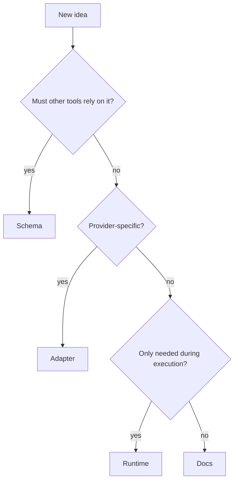

---
tags:
  - research/topic-2
  - frame/schema
  - haxaml/runtime
status: draft-1
date: 2026-05-23
---

# Schema, Adapter, Runtime, Docs Split

## Tiny Idea

When adding a new idea to FRAME + Haxaml, do not ask only:

> What YAML field should we add?

Ask:

> Is this project truth, provider wording, task-time behavior, or human explanation?

That gives four buckets.

## The Four Buckets

| Bucket | Plain job | Good examples |
| --- | --- | --- |
| schema | stable machine-checkable project state | facts identity, rule severity, blockers, done criteria |
| adapter | provider-specific files generated from state | AGENTS.md, CLAUDE.md, skills, MCP config snippets |
| runtime | behavior while handling a task | context selection, gates, verification, archive lookup |
| docs | human learning and examples | guides, migration notes, comparison tables |

## How To Decide



## Examples

| Idea | Best bucket | Why |
| --- | --- | --- |
| `rule.severity: blocking` | schema | tools need to agree on stop behavior |
| "Use XML tags for Claude prompt sections" | adapter | provider shape, not project truth |
| "Search Acts archive only after recent Acts fails" | runtime | behavior, not a field users should hand-edit |
| "What does `expect.yaml` mean?" | docs | humans need the concept clearly explained |
| "Acceptance criteria for run 2" | schema | agent and human both need a checkable target |
| "Print a colorful setup wizard" | runtime/UI | experience behavior, not core architecture truth |

## Why This Matters

FRAME is trying to become standard-architecture-shaped.

A standard context architecture should not be overloaded with UI details, provider hacks, or temporary behaviors.

Bad design:

```text
Put everything in expect.yaml.
```

Better design:

```text
Expect stores expected outcomes and progress checkpoints.
Haxaml decides when to read it, when to compare it with Acts, and when to ask the user before changing it.
Adapters translate it for each agent.
Docs explain it to humans.
```

## Practical Rule For 0.8

> Schema fields should be boring, stable, and useful to more than one runtime.

If a field only exists because one prompt template needs nicer wording, keep it out of core FRAME.
