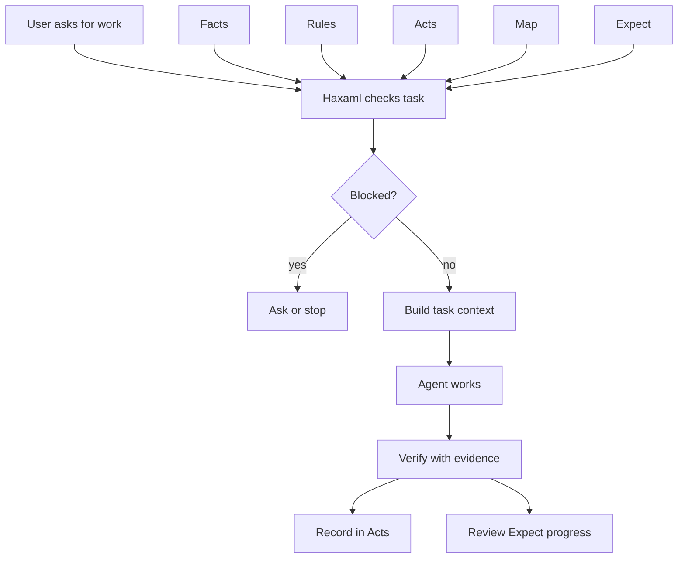
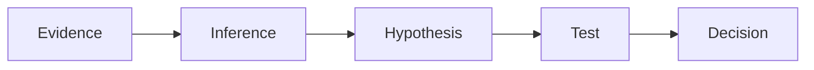

---
tags:
  - research/topic-3
  - frame/standard-context-architecture
  - haxaml/runtime
  - project-brain
status: draft-1
date: 2026-05-24
---

# Research 3: FRAME As A Standard Context Architecture

## Plain-Language Summary

Research 1 said context structure matters.

Research 2 said prompt and context techniques map well to FRAME when the content is durable project context.

Research 3 asks the bigger question:

> Can FRAME become a standard context architecture and structure for agent-ready projects, with Haxaml as the tool on top?

My current answer:

> FRAME can become a standard context architecture candidate if it defines a repo-owned project brain. Haxaml should be the tool/runtime that operates that brain, not the owner of the meaning.

Think of it like this:

- FRAME is the project constitution, map, diary, and checklist.
- Haxaml is one government that follows that constitution.
- If another tool can read the constitution and act correctly, FRAME is standard-shaped.
- If only Haxaml understands it, then FRAME is just Haxaml config.

## The Problem We Are Really Solving

AI-heavy projects often lose their center.

The project may have:

- one `AGENTS.md`
- one `CLAUDE.md`
- one `GEMINI.md`
- old chat decisions
- scattered tasks
- local memory files
- test commands in random docs
- previous agents making different assumptions

That works for small tasks.

It breaks down when:

- many agents touch the project
- the project lasts months
- the codebase grows
- context windows fill up
- old memory becomes stale
- verification gets skipped
- nobody can tell what is true, planned, blocked, or already done

The missing thing is not just "more docs."

The missing thing is:

> a repo-owned project brain with typed roles and behavior.

## What A Standard Context Architecture Means Here

A standard context architecture can sound fancy, so keep it small.

A standard context architecture is a shared project structure.

It says:

- what files exist
- what each field means
- what can override what
- what blocks work
- what can be summarized
- what must stay exact
- what evidence is required
- how tools should read and update state

Weak structure:

```text
Put project truth in facts.yaml.
Put rules in rules.yaml.
```

Better standard context architecture:

```text
Rules with severity block stop prebuild and record.
Facts with source=user_input outrank detected guesses.
Acts verification records can mark Expect checkpoints.
Map impact entries can recommend verification commands.
Provider adapters are generated output, not source truth.
```

The second version is useful because different tools can understand the same structure and Haxaml can operate it consistently.

## Current Ecosystem Snapshot

The ecosystem already has strong pieces.

| System | What it covers well | What it does not fully cover |
| --- | --- | --- |
| AGENTS.md | simple repo instructions for coding agents | no typed state, no history, no verification model |
| Claude Code memory | project/user/org instructions and auto memory | provider-specific and context, not a vendor-neutral FRAME schema |
| Gemini `GEMINI.md` | hierarchical context files with imports | instructions, not full project-brain behavior |
| Cline Memory Bank | structured project memory files | markdown method, weaker formal schema/runtime contract |
| Agent OS | standards, product, specs | strong workflow, not the same five-part repo brain/evidence model |
| GitHub Spec Kit | spec -> plan -> tasks -> implement | feature/spec flow, not persistent project-state protocol |
| Kiro | steering, specs, hooks | strong IDE workflow, not vendor-neutral FRAME state |
| Aider repo map | codebase minimap | map only, not facts/rules/acts/expect |
| MCP | tools/resources/prompts protocol | runtime integration, not repo-owned project memory |
| A2A | agent-to-agent communication | agent communication, not project brain |
| AG-UI | agent-to-user interaction events | UI/runtime protocol, not repo schema |
| Letta/MemGPT | agent memory systems | memory-first, not repo-native project contract |

The pattern is clear:

> Most systems cover one side of the problem. FRAME's possible value is connecting project truth, rules, history, map, and expected work into one repo-owned context architecture.

## What FRAME Adds

FRAME's five files can be explained as five project questions.

| FRAME file | Plain question | Architecture role |
| --- | --- | --- |
| `facts.yaml` | What is true about this project? | stable truth |
| `rules.yaml` | What must agents obey? | behavior constraints |
| `acts.yaml` | What actually happened? | evidence and continuity |
| `map.yaml` | What does each important file or area do? | short repo map |
| `expect.yaml` | What should happen next? | planned path and done checks |

The key is that these files should not be isolated.

Example:

```text
Facts says package manager is uv.
Rules says use the declared package manager.
Expect says release task needs package build.
Map summarizes pyproject.toml and release scripts so the tool knows where to inspect first.
Acts records uv build and uv publish evidence.
```

That is the project brain working as one readable context structure.

## What Haxaml Adds

FRAME alone is state.

Haxaml is runtime behavior.

Haxaml should:

- inspect FRAME
- check missing information
- select task context
- enforce blockers
- build provider adapters
- verify work
- record proof in Acts
- compare work against Expect
- keep hot state usable



The important boundary:

> Haxaml can be the first serious tool on top of FRAME, but FRAME should be defined clearly enough that another tool could understand the structure later.

## Standard Boundary: FRAME Architecture vs Haxaml Tool

This boundary is the make-or-break point.

| Layer | Should own | Should not own |
| --- | --- | --- |
| FRAME architecture standard | file roles, field meaning, IDs, evidence shape, blockers, references, update rules | terminal UI, Haxaml-only command names, provider prompt wording |
| Haxaml tool/runtime | setup, validation, context assembly, gates, verification, record, adapters | canonical meaning that only Haxaml understands |
| Provider adapters | AGENTS.md, CLAUDE.md, GEMINI.md, skills, MCP config | source truth for project state |
| Research/docs | examples, migration guides, comparisons, test lab notes | hidden behavior not backed by schema |

Simple rule:

> If another tool must know it to behave correctly, it belongs in FRAME. If it is how Haxaml performs the behavior, it belongs in Haxaml.

## Security And Stale Context Risks

Standard context architecture work must include trust rules.

The danger is not only malicious input. It is also stale truth.

Common failure:

```text
Old Acts says tests were skipped once.
Current Rules says release needs tests.
Agent sees old note first and treats it like permission.
```

FRAME needs source priority.

Possible priority stack to test:

1. platform/system rules
2. `rules.yaml` blocking rules
3. owner-confirmed facts
4. current Expect done checks
5. current Map impact scope
6. recent Acts evidence
7. archived Acts
8. external context
9. unchecked tool output

This is not final. It is a hypothesis.

But the point is non-negotiable:

> A weaker context item should not silently override a stronger rule.

## Public Reasoning Trace

The user asked for extra reasoning steps and chain of thought.

I cannot provide private hidden chain-of-thought. What matters for research is the auditable version:



Here is the useful reasoning trace:

| Step | Evidence | Inference | What it means for FRAME |
| --- | --- | --- | --- |
| 1 | AGENTS.md and provider memory files are widely used for instructions. | Repo-level agent context is becoming normal. | FRAME should not fight AGENTS.md; it should generate/adapt to it. |
| 2 | Cline Memory Bank and Agent OS split project knowledge into roles. | Role-separated project context is a real pattern. | FRAME's five roles are plausible, not random. |
| 3 | MCP, A2A, and AG-UI each standardize one communication boundary. | Agent ecosystems are moving toward shared contracts. | FRAME needs a crisp boundary too: repo project context architecture. |
| 4 | Letta/MemGPT show memory must be managed, not dumped. | Long-term state needs hot/cold separation and retrieval. | Acts cannot be a replay log in hot context. |
| 5 | Kiro and Spec Kit show structured specs improve planning. | Expected work needs durable artifacts. | Expect should become run guideline/checklist, not a final writeback sink. |
| 6 | No checked source shows a widely adopted vendor-neutral schema combining Facts, Rules, Acts, Map, Expect, gates, evidence, and adapters. | The exact FRAME combination appears underexplored. | FRAME has a credible research gap, but still needs proof. |

Conclusion:

> FRAME + Haxaml is not obviously a solved problem. It is also not automatically mature enough to call a standard. The right label is standard context architecture candidate.

## Evaluation Plan

FRAME needs tests against simpler approaches.

| Test | Compare | Signal |
| --- | --- | --- |
| instructions only | AGENTS.md alone vs FRAME adapter | does FRAME add value beyond instructions? |
| memory continuity | plain session summary vs Acts | does next-agent handoff improve? |
| file routing | grep/read repo vs Map-guided context | fewer wrong file reads and edits? |
| expected work | chat task only vs Expect checklist | better completion and fewer scope misses? |
| blocker behavior | advisory missing info vs hard gate | fewer fake-done outcomes? |
| stale memory | injected old Acts vs trust-priority rules | can Haxaml catch stale context? |
| provider drift | manual adapters vs generated adapters | do Codex/Claude/Gemini stay aligned? |

No proof, no bragging.

If FRAME cannot beat simpler setups in at least some real task classes, then it should stay a Haxaml feature, not become a standard architecture claim.

## What This Means For 0.8

Research 3 supports the updated 0.8 roadmap direction:

> build vertical schema slices across all five files, not one file per release.

Why?

Because the architecture value lives in the connections.

Examples:

- Rules activate from Facts.
- Acts marks Expect progress.
- Map recommends verification.
- Rules decide whether an Expect item blocks work.
- Facts shape Map defaults.

So `0.8.0` should not "finish Facts."

It should define the shared base layer across all five files:

- version
- role
- source
- owner
- unknowns
- minimum valid empty state

Then deeper releases add evidence, blockers, references, context behavior, verification, and schema-lab testing across all five files together.

## Bottom Line

FRAME can become a serious standard context architecture candidate if we keep the boundary clean:

- FRAME is the repo-owned project-brain structure.
- Haxaml is the tool/runtime that operates it.
- Adapters are generated surfaces, not source truth.
- Research and tests decide what becomes stable.

The next work is not more hype.

The next work is precision:

> define the contract, test the contract, and keep what survives.
