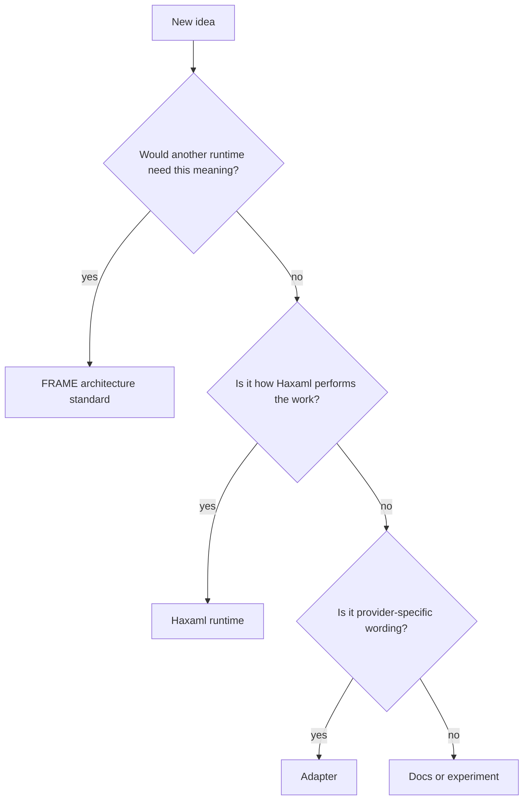

---
tags:
  - research/topic-3
  - frame/standard-context-architecture
  - haxaml/runtime
status: draft-1
date: 2026-05-24
---

# Standard Boundary: FRAME Architecture vs Haxaml Tool

## Tiny Idea

If FRAME is the standard context architecture, Haxaml cannot be the whole truth.

Haxaml can be the first serious tool/runtime.
FRAME has to be understandable without Haxaml internals.

Analogy:

- HTML is the shared document contract.
- Chrome is one browser that renders it.
- If a page only works because Chrome secretly knows private meanings, that is not clean HTML.

Same here:

- FRAME is the shared project-brain architecture.
- Haxaml is one tool/runtime that reads and operates it.

## What FRAME Should Own

FRAME should own meanings that another tool would need to implement correctly.

| FRAME-owned meaning | Why it belongs in FRAME |
| --- | --- |
| file roles | tools need to know why each file exists |
| schema versions | tools need version checks |
| field meanings | tools need to read the same fields the same way |
| IDs and references | tools need stable cross-file links |
| evidence shape | tools need source-backed claims |
| blockers/advisory status | tools need to know what stops work |
| context policies | tools need to know what loads when |
| trust priority | tools need to know what can override what |
| update rules | tools need to know where reality is recorded |

## What Haxaml Should Own

Haxaml should own execution.

| Haxaml-owned behavior | Why it belongs in Haxaml |
| --- | --- |
| CLI/TUI setup | product experience, not architecture truth |
| MCP tool names | Haxaml API surface |
| context-pack assembly algorithm | runtime implementation |
| archive storage format | implementation detail unless standardized later |
| provider adapter rendering | output generation |
| terminal output style | UX, not architecture |
| exact Python classes | implementation |

## What Adapters Should Own

Adapters translate FRAME into each agent's native language.

Examples:

- `AGENTS.md`
- `CLAUDE.md`
- `GEMINI.md`
- Codex skills
- Claude skills
- Copilot instructions
- MCP config

Adapter rule:

> Adapters should point back to FRAME or be generated from FRAME. They should not become a second source of truth.

## Decision Test

When adding something new, ask:



## Why This Matters

Without this boundary, FRAME becomes impossible to standardize.

Bad path:

```text
FRAME means whatever Haxaml currently does.
```

Good path:

```text
FRAME defines the standard structure.
Haxaml implements and operates that structure.
Tests prove the structure works outside Haxaml's own repo.
```

That is the difference between tool config and a real context architecture.
