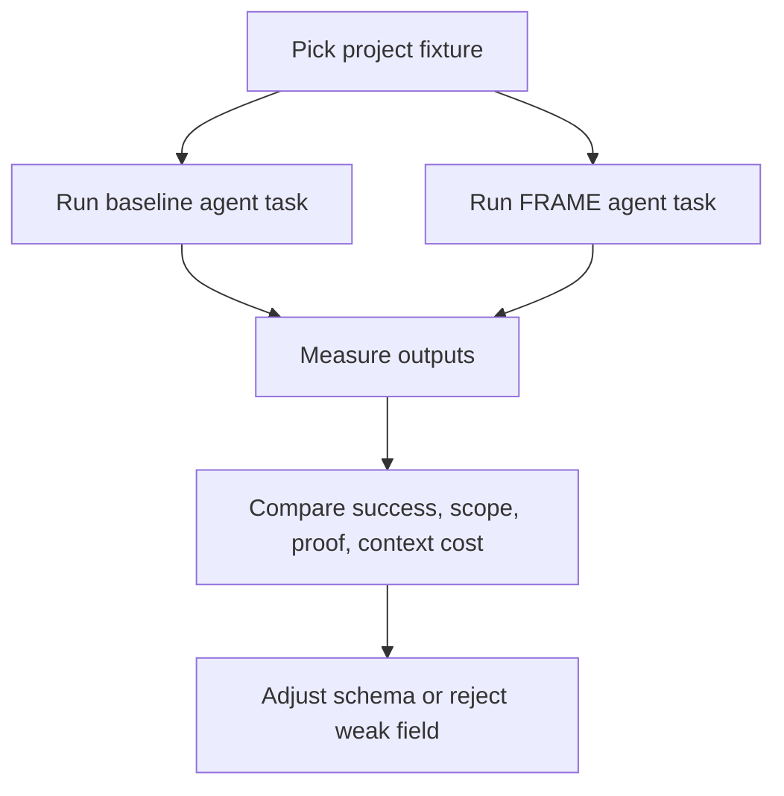

---
tags:
  - research/topic-3
  - evaluation
  - schema-lab
status: draft-1
date: 2026-05-24
---

# Evaluation Plan For Standard Context Architecture

## Tiny Idea

FRAME cannot become a standard context architecture because it sounds good.

It has to survive tests.

## What To Compare Against

FRAME should be tested against simpler setups.

| Baseline | Why |
| --- | --- |
| README only | lowest-friction normal repo state |
| AGENTS.md only | common agent instruction baseline |
| AGENTS.md + plan.md | simple project plan baseline |
| Cline Memory Bank style | closest markdown project-memory baseline |
| Agent OS style | closest standards/product/spec baseline |
| Haxaml FRAME | candidate standard context architecture |

## Test Types

| Test | What it checks |
| --- | --- |
| new feature task | Does Expect guide scope and done checks? |
| bug fix task | Does Map route to the right files? |
| release task | Do Rules and Facts prevent wrong commands? |
| multi-session task | Does Acts help the next agent continue? |
| missing info task | Do blockers stop fake progress? |
| stale memory task | Does trust priority catch old context? |
| provider switch task | Do adapters keep Codex/Claude/Gemini aligned? |

## Metrics

| Metric | Plain meaning |
| --- | --- |
| task success | did the work actually solve the request? |
| tests passed | did verification support the claim? |
| wrong file reads | did the agent wander? |
| wrong file edits | did the agent touch unrelated files? |
| blocker catch rate | did it stop when info was missing? |
| handoff quality | could a new agent continue quickly? |
| context size | did the setup waste tokens? |
| stale-context failures | did old memory mislead the agent? |
| provider drift | did different agents see different truth? |

## Schema Lab

The schema lab should use varied projects.

| Project type | What it stresses |
| --- | --- |
| Python CLI/library | package metadata, tests, release tasks |
| Web app | UI/backend split, routing, assets |
| API/backend service | persistence, auth, migrations |
| Mobile app | build tools, platform targets, app store flow |
| Monorepo | ownership, nested instructions, impact rules |
| AI agent/MCP project | tools, schemas, runtime behavior |
| Messy legacy repo | incomplete docs, stale assumptions, weak tests |

The lab should not only use clean repos.

One messy repo is required because real agent work often starts from weird state.

## Experiment Shape

## Decision Rules

| Result | Decision |
| --- | --- |
| FRAME improves success or handoff with acceptable overhead | keep and refine |
| FRAME only adds noise | simplify or drop fields |
| FRAME helps one project type only | make field optional or project-type specific |
| FRAME blocks too often | tune blocker severity |
| FRAME misses stale context | strengthen trust/source rules |

## Practical 0.8 Link

This matches the revised `0.8.x` roadmap:

- early 0.8 builds vertical schema slices
- `0.8.6` creates the schema lab
- `0.8.7` freezes only what survives
- `0.9.x` becomes serious evaluation, not schema guessing
