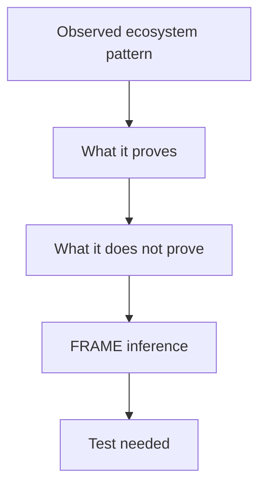

---
tags:
  - research/topic-3
  - reasoning-trace
  - evidence
status: draft-1
date: 2026-05-24
---

# Research 3 Public Reasoning Trace

## Important Boundary

This is not private chain-of-thought.

This is the useful public version:

> claim -> evidence -> inference -> confidence -> next test

That is what belongs in a research vault.

## Reasoning Ladder



## Trace Table

| Claim | Evidence checked | Inference | Confidence | Test needed |
| --- | --- | --- | --- | --- |
| Repo-level agent instructions are becoming normal. | AGENTS.md, Codex AGENTS.md, Claude CLAUDE.md, Gemini GEMINI.md | Agents need durable repo context. | High | Compare AGENTS-only vs FRAME adapters. |
| Markdown instruction files are not enough for full project state. | AGENTS.md says no required fields; Claude/Gemini are instruction/context files | Markdown is good for instructions but weak for typed state. | Medium-high | Try representing blockers/evidence/progress in markdown only. |
| Role-separated project memory is a real pattern. | Cline Memory Bank, Agent OS, Kiro steering/specs | FRAME's role split is plausible. | High | Compare FRAME roles to Cline/Agent OS roles. |
| Runtime protocols are maturing around agents. | MCP, A2A, AG-UI | The ecosystem is standardizing boundaries between tools, agents, and UI. | High | Define FRAME's boundary as project context architecture, not another runtime protocol. |
| Memory needs hot/cold separation. | Letta, MemGPT, Cline context-window advice, Research 1 long-context findings | Acts must not become hot replay history. | High | Test hot Acts budgets with long project histories. |
| The exact FRAME combination appears underexplored. | No source found combining Facts/Rules/Acts/Map/Expect with evidence, gates, adapters, and runtime behavior as one repo schema | FRAME may occupy a real gap. | Medium | Continue Research 4 and schema-lab comparison. |
| Haxaml should not define FRAME by accident. | MCP and other standards separate shared contract from implementation behavior. | FRAME needs an architecture/tool boundary. | High | Write a small mock tool that reads FRAME without Haxaml internals. |

## Reasoning Notes

### Why "standard context architecture candidate" is the right label

Not enough:

```text
FRAME feels useful.
```

Enough to keep researching:

```text
Adjacent systems cover instructions, memory, specs, maps, tools, agent communication, and UI events.
The exact repo-owned five-part project brain is not clearly covered by one widely adopted standard.
FRAME has a plausible standard-architecture gap, but must prove value through schemas and tests.
```

### Why Research 4 matters

Research 3 says:

> There is a possible gap.

Research 4 must answer:

> What exact architecture should fill it without becoming too heavy?

That means Research 4 needs to define:

- hot vs task-scoped vs archived context
- exact vs summary-safe data
- source priority
- blocker semantics
- reference rules
- extension fields
- schema lab fixtures

## Current Research Position

| Label | Statement |
| --- | --- |
| Evidence | Agent tools already use repo instructions, memory files, specs, maps, and runtime protocols. |
| Inference | FRAME's role split maps to real needs across those systems. |
| Hypothesis | FRAME can become a useful standard context architecture, with Haxaml as the tool built on it. |
| Unknown | Whether FRAME is better than simpler approaches in real tasks. |
