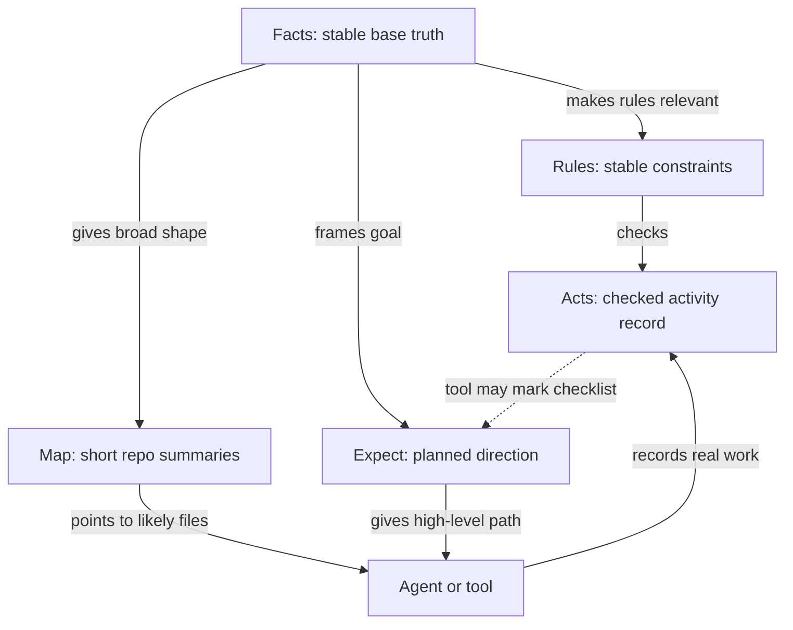

---
tags:
  - research/topic-3
  - frame/schema
  - roadmap/0.8
  - standard-context-architecture
status: draft-1
date: 2026-05-24
---

# FRAME Schema Research: 0.8.0 Opening

## Tiny Idea

This is the first schema research slice for `0.8.0`.

The goal is not to finish all five FRAME schemas in one shot.

The goal is smaller and cleaner:

> define the first shared base layer that can stand across `facts.yaml`, `rules.yaml`, `acts.yaml`, `map.yaml`, and `expect.yaml`.

Analogy:

> We are not decorating rooms yet. We are checking whether the foundation lines up across the whole house.

## Research Setup

This sub-research used five focused schema reviewers:

| Reviewer focus | Main question |
| --- | --- |
| Facts | What stable project truth should exist before agents act? |
| Rules | What behavior rules can actually block, warn, or require proof? |
| Acts | What should be recorded as real work without becoming chat replay? |
| Map | How should projects expose routing, ownership, impact, and risk zones? |
| Expect | How should planned work, run checklists, and done checks be represented? |

The shared instruction was important:

> Each file gets its own role, but the schema must mature as one clear context architecture.

## Main Finding

The team converged on the same shape:

> `0.8.0` should standardize a tiny shared `frame` block and a minimal useful body per file. Evidence, blockers, cross-file references, context rules, and verification syncing should come in later vertical slices.

That matches the current [[08 Roadmap Recommendations For 0_8|0.8 roadmap direction]].

## Shared Base Layer

Every FRAME file should start with a shared base block.

Candidate:

```yaml
frame:
  file: facts
  schema_version: 0.8.0
  role: stable_project_truth
  status: draft
  last_reviewed: null
  updated_by: null
  update_reason: null
```

Possible optional field:

```yaml
  source_policy: owner_or_verified_repository
```

Open question:

> Should `source_policy` be frozen in `0.8.0`, or wait for the evidence/source layer in `0.8.1`?

My recommendation:

- keep `source_policy` allowed in `0.8.0`
- do not require it until `0.8.1`

## Minimal 0.8.0 Schema Slice

This is the smallest serious base across all five files.

| File | Minimal body |
| --- | --- |
| `facts.yaml` | `identity`, `classification`, `technology`, `unknowns` |
| `rules.yaml` | `rules[]`, `unknowns` |
| `acts.yaml` | `entries[]`, optional `archive.policy`, optional `archive.pointer` |
| `map.yaml` | `entries[]` or `project_routes[]` with short repo summaries |
| `expect.yaml` | `planning`, `runs[]`, `acceptance[]` |

## The Connected Picture



The key rule:

> Connections should exist only when they change meaning for a human or tool.

Not every field needs a cross-file link.

FRAME itself stays static. Haxaml or another tool does the checking, context selection, recording, and optional checklist updates.

## Candidate File Roles

| File | Plain role | Must not become |
| --- | --- | --- |
| `facts.yaml` | stable project truth | a README clone or guessed marketing doc |
| `rules.yaml` | behavior constraints | polite advice that Haxaml cannot act on |
| `acts.yaml` | checked activity log | chat transcript or second plan file |
| `map.yaml` | short repo summaries and safe first places to inspect | stale docs, fake ownership map, or verbose repo encyclopedia |
| `expect.yaml` | planned path and done checks | rigid fantasy schedule |

## Candidate Entry Families

| File | Candidate entries |
| --- | --- |
| Facts | identity, purpose, classification, technology, architecture, interfaces, persistence, external dependencies, capabilities, actors, unknowns |
| Rules | invariant, conditional, gate, escalation, forbidden, trust priority |
| Acts | work, verify, blocker, decision, handoff |
| Map | file or folder summaries, touch hints, check hints, generated/vendor/ignore markers |
| Expect | planning, runs, checklist, acceptance, progress, course corrections |

## What Should Connect First

These are the strongest first connections.

| Connection | Meaning |
| --- | --- |
| Facts `technology.package_managers` -> Rules conditional rule | package manager rules activate from verified Facts |
| Facts `classification.project_type` -> Rules conditional rule | project type activates relevant constraints |
| Facts `architecture.major_parts` -> Map summaries | broad project shape helps start the map, but the map must be checked against files |
| Map summaries -> Expect `runs.target_refs` | planned work can point at likely areas |
| Expect `acceptance` -> Acts `verify` | done checks need proof before a tool trusts them |
| Rules `rules[]` -> Acts `entries[]` | activity records should be valid under rules |
| Acts `verify` -> Expect `progress` | a tool may mark expected progress from verified work |

## What Should Stay Local

Some entries are useful without driving other files.

| File | Local-only candidates | Why |
| --- | --- | --- |
| Facts | repository URL, actors, broad purpose, descriptive architecture style | useful context, weak runtime signal |
| Rules | severity semantics, generic forbidden actions, escalation classes | defines behavior system itself |
| Acts | session id, failed attempts, temporary workarounds, short handoff note | continuity, not durable truth |
| Map | ignore paths, generated paths, vendor paths, aliases | routing help, not project truth |
| Expect | estimated runs, priority, notes, soft sequencing | planning aid, not hard truth |

This matters.

Over-connecting every field would make FRAME noisy and fake-smart.

## Early Schema Grammar

FRAME needs a small language for relationships.

Candidate relationship types:

| Relationship | Plain meaning | Example |
| --- | --- | --- |
| `activates` | one field turns on a rule | Facts package manager activates uv rule |
| `suggests` | one file gives a starting point, not final truth | Facts architecture suggests Map areas |
| `targets` | expected work points to routes | Expect run targets Map auth route |
| `checks` | one file gives a condition another record can be checked against | Rules check Acts entries |
| `records` | Acts records real outcome | Haxaml record writes Acts work entry |
| `marks_progress` | verified work can mark checklist progress through a tool | Acts verify marks Expect item done |
| `blocks` | unresolved item stops progress | Rules gate blocks context pack |
| `informs` | context helps interpretation, but does not control | Facts actors informs wording |
| `local_only` | useful only inside one file | Map ignore paths |

This relationship language should be tested before becoming schema syntax.

## 0.8.0 Recommendation

Freeze only the base layer.

Do freeze:

- shared `frame` block
- minimal valid empty shape for every file
- basic entry IDs where entries exist
- plain file roles
- unknowns as explicit non-guesses
- Map as short repo summaries, not full documentation

Do not freeze yet:

- full evidence shape
- blocker object grammar
- final cross-file reference syntax
- context pack selection rules
- automatic Expect sync
- archive storage layout
- full enum universe

The serious win for `0.8.0` is:

> every FRAME file can identify itself, state its role, hold a minimal honest body, and avoid forcing agents to invent missing truth.

## Next Research Step

This sub-research opens the schema work.

The next step should be:

> use the canvas to refine candidate fields and links, then test the shape against at least three project types before freezing any heavy fields.

Recommended first test projects:

- Haxaml itself: AI/MCP/devtool package
- one web or API app
- one messy legacy or monorepo project
