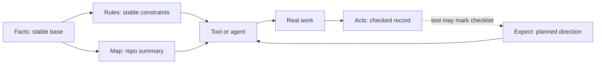

---
tags:
  - research/topic-3
  - frame/schema
  - semantic-links
status: draft-1
date: 2026-05-24
---

# Semantic Connection Rules

## Tiny Idea

FRAME becomes a useful project brain only if the files connect carefully.

Not everything connects.

The point is meaningful links, not spaghetti.

Important boundary:

> FRAME is static. Tools do the active work.

So a connection means "this field has meaning for another file or tool." It does not mean the YAML magically updates itself.

## Connection Types

| Link type | Meaning | Example |
| --- | --- | --- |
| `activates` | a stable fact makes a rule relevant | Facts package manager makes uv rules relevant |
| `suggests` | one file gives a starting point, but the tool must still check reality | Facts architecture suggests Map areas |
| `targets` | planned work points to project areas | Expect run targets Map path group |
| `checks` | one file gives a condition another record can be checked against | Rules check Acts entries |
| `requires_proof` | a done check needs proof before it is trusted | Expect acceptance needs Acts verify |
| `records` | real work is written down by a tool | Haxaml writes Acts work entry |
| `marks_progress` | a tool may update checklist status from verified work | Acts verify can mark Expect item done |
| `blocks` | unresolved issue tells a tool to stop or ask first | required unknown blocks build |
| `informs` | useful context, not hard behavior | Facts actors informs wording |
| `local_only` | useful only inside one file | Map ignore paths |

## Strong First Links

| From | To | Link | Why it matters |
| --- | --- | --- | --- |
| Facts `technology.package_managers` | Rules `conditional` | activates | commands should follow verified stack |
| Facts `classification.project_type` | Rules `conditional` | activates | CLI, MCP, web, mobile need different constraints |
| Facts `architecture.major_parts` | Map short summaries | suggests | map can start from broad architecture, but must be checked against files |
| Facts `interfaces` | Expect `acceptance` | informs | public surfaces need done checks |
| Facts `unknowns` | Rules `gate` | blocks | unknown required facts should stop fake progress |
| Rules `gate` | Haxaml prebuild/context pack | blocks | rules become behavior |
| Rules `rules[]` | Acts `entries[]` | checks | activity records should be valid under the rules |
| Map summaries | Tool context selection | informs | map tells the tool where to inspect first |
| Map summaries | Expect `runs.target_refs` | targets | planned work can name likely areas |
| Map `check_when_changed` | Expect `acceptance` | suggests | map can suggest checks, but not force policy |
| Expect `runs` | Acts `work` | records | actual work can link back to an expected run |
| Expect `acceptance` | Acts `verify` | requires_proof | proof should satisfy planned criteria |
| Acts `verify` | Expect `progress` | marks_progress | a tool may mark progress from verified work |
| Acts `blocker` | Expect `runs.status` | blocks | a tool may mark an expected run blocked |

## Links To Avoid Early

| Bad link | Why |
| --- | --- |
| Acts old session summary -> Rules truth | stale history should not create or change rules |
| Map risk zone -> blocking rule automatically | risk is not policy until Rules says so |
| Facts actors -> hard behavior | actors are useful context but usually not gates |
| Expect estimated_runs -> runtime blocking | estimate is not proof |
| Capabilities -> done checks automatically | capabilities can be vague without proof |

## The Clean Mental Model

## The Rule For New Links

Before adding a link, ask:

1. Does this link change behavior or interpretation?
2. Can another tool understand it from the docs?
3. Is the source field stronger than the target field?
4. Could this create stale truth?
5. Can this be tested in the schema lab?

If the answer is no, keep the field local.

Extra rule:

> If a link makes FRAME look dynamic, move that behavior into Haxaml or another tool. FRAME should stay as the stable structure.
