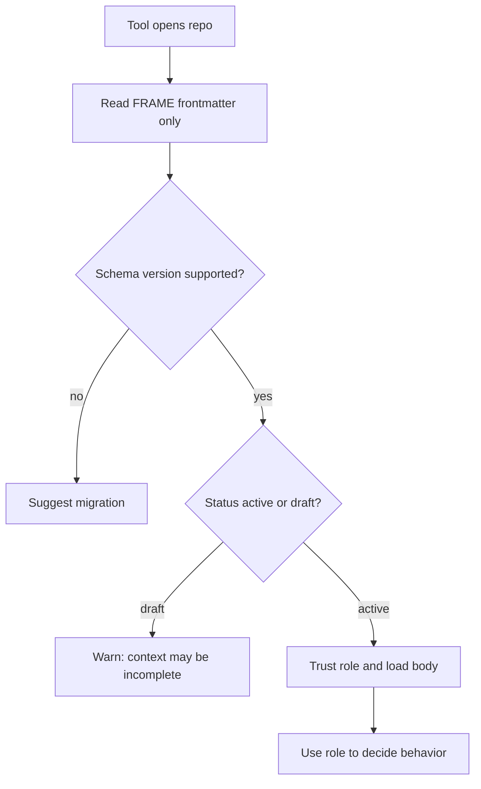

---
tags:
  - research/topic-3
  - frame/schema
  - roadmap/0.8
status: draft-1
date: 2026-05-24
---

# FRAME Frontmatter 0_8_0

## Tiny Idea

Every FRAME file should start with the same small `frame` block.

It works like frontmatter.

Analogy:

> Before reading a book, you check the cover: title, edition, and what kind of book it is.

The `frame` block is that cover.

It helps a human, agent, or tool know what it is looking at before trusting the rest of the file.

Another way to say it:

> FRAME frontmatter is the handshake layer between a repo and any agent/tool.

Before Haxaml, Codex, Claude, CI, or another future tool reads the full file, the header tells it:

- what FRAME file this is
- what schema version it claims
- what job this file has
- whether the file should be treated as draft, active, or old

That is the start of an agent-ready repo passport.

## Starting Shape

```yaml
frame:
  file: facts
  schema_version: 0.8.0
  role: stable_project_truth
  status: draft
  last_reviewed: null
  updated_by: null
  update_reason: null
```

## Field Reasoning

| Field | Why it exists | Tool value |
| --- | --- | --- |
| `file` | Says which FRAME file this is. | Prevents a tool from treating `facts.yaml` like `acts.yaml`. |
| `schema_version` | Says which schema contract this file follows. | Lets tools choose the right validator and migration path. |
| `role` | Says the job of the file in plain language. | Helps agents avoid mixing meanings, like using Acts as project truth. |
| `status` | Says whether the file is draft, active, or deprecated. | Lets tools warn before trusting unfinished or old files. |
| `last_reviewed` | Optional date for stale-context checks. | Helps tools ask, "is this still current?" |
| `updated_by` | Optional source of the last edit. | Helps teams see whether a human, agent, or setup tool changed it. |
| `update_reason` | Optional short reason for the last edit. | Gives enough context without turning the header into a journal. |

## Future Tool Use

Haxaml can use this frontmatter like a bootloader.

The tool does not need to read the full body first. It can quickly inspect the header and decide what to do next.



Example:

| Tool question | Frontmatter answer |
| --- | --- |
| Is this really `facts.yaml`? | `file: facts` |
| Which validator should I use? | `schema_version: 0.8.0` |
| How should I treat this file? | `role: stable_project_truth` |
| Should I fully trust it yet? | `status: draft` or `status: active` |
| Could the file be stale? | `last_reviewed` |

This gives tools a clean first pass before they spend tokens reading the body.

## Current Role Review

| File | Current role | Take |
| --- | --- | --- |
| `facts.yaml` | `stable_project_truth` | Strong. Keep. |
| `rules.yaml` | `project_instruction_blueprint` | This file defines the project's instruction blueprint layer. |
| `acts.yaml` | `checked_activity_record` | Accurate. Slightly long, but clear. |
| `map.yaml` | `repo_context_map` | Strong. Very clear. |
| `expect.yaml` | `project_correctness_contract` | Good. It makes Expect sound like proof and completion logic, not just scheduling. |

The role names should feel boring in a good way.

They are not branding. They are labels a tool can trust.

## Required vs Optional

Keep required:

- `file`
- `schema_version`
- `role`
- `status`

Keep optional:

- `last_reviewed`
- `updated_by`
- `update_reason`

Why:

> The required fields identify the file. The optional fields help trust the file.

If we require too much metadata, people will fill fake values just to pass validation. Fake metadata is worse than missing metadata.

## Role Names For 0.8.0

| File | Role |
| --- | --- |
| `facts.yaml` | `stable_project_truth` |
| `rules.yaml` | `project_instruction_blueprint` |
| `acts.yaml` | `checked_activity_record` |
| `map.yaml` | `repo_context_map` |
| `expect.yaml` | `project_correctness_contract` |

These names are intentionally plain.

They are not trying to be academic. They are trying to stop agents from mixing responsibilities.

## What Not To Add Yet

Do not add these to the frontmatter yet:

| Field idea | Why not yet |
| --- | --- |
| `confidence` | This belongs to the evidence/source slice, not the first header. |
| `owner` | Useful later, but not required for every repo on day one. |
| `generated_by` | Haxaml-specific. FRAME should not be too Haxaml-shaped. |
| `checksum` | Runtime/tool concern. Not needed for a human-editable schema start. |
| `dependencies` | Belongs inside the file body or later relationship model. |
| `maturity` | Might be useful later, but `status` is enough for the first slice. |

## Sweet Spot

The frontmatter should answer only three questions:

1. What FRAME file is this?
2. Which schema version does it claim?
3. What role should a tool or agent assign to it?

Everything else should earn its place later.

## Important Warning

In the first `0.8.0` slice, the schema can validate the identity of a FRAME file before validating whether the body is useful.

That is intentional.

Plain version:

> `0.8.0` first proves every FRAME file can say what it is. Later slices prove the body is actually useful.

This means a file can have valid frontmatter while still being too empty to guide real work.

That is not a bug in the first slice. It is the staging plan:

| Stage | What validation proves |
| --- | --- |
| `0.8.0` frontmatter | This is a known FRAME file with a known role and version. |
| Later body slices | This file contains useful project context. |
| Later evidence slices | This file can show where important claims came from. |
| Later tool behavior | Haxaml can decide what to load, warn about, block, or update. |

The frontmatter should stay small so the body can carry the real meaning.
